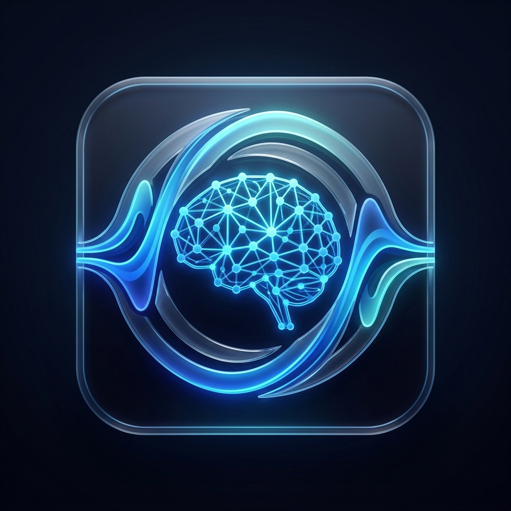

# Resemble Enhance Native - Ultimate Audio Suite

## 💎 究極の AI 音声プロセッシング・スイート / The Ultimate AI Audio Processing Suite

Resemble Enhance を C++ でフルスクラッチ再構築し、プロフェッショナルな機能をすべて統合した究極のネイティブ・アプリケーションです。
A ground-up C++ reconstruction of Resemble Enhance, integrating professional-grade features into a high-performance native application.

---

### 🚀 主要機能 (Ultimate Features)

1.  **爆速 GPU 加速 (DirectML) / Blazing Fast GPU Acceleration**
    *   ONNX Runtime と DirectML を統合。NVIDIA, AMD, Intel のあらゆる GPU で AI 推論を高速化します。
    *   Integrates ONNX Runtime with DirectML, accelerating AI inference across all NVIDIA, AMD, and Intel GPUs.
2.  **一括バッチ処理 (Batch Mode) / Batch Processing**
    *   複数のファイルをドラッグ＆ドロップでキューに追加し、一括で高音質化。
    *   Drag and drop multiple files into the queue for high-quality enhancement in bulk.
3.  **リアルタイム・マイクモニター (Live Monitor) / Real-time Microphone Monitoring**
    *   マイク入力をリアルタイムで AI 処理。低遅延モード搭載。
    *   Real-time AI processing for microphone input with a low-latency mode.
4.  **マルチフォーマット対応 (FFmpeg Integration) / Multi-format Support**
    *   FFmpeg バックエンドを内蔵。`.mp3`, `.flac`, `.m4a` などあらゆる形式に対応。
    *   Built-in FFmpeg backend supporting various formats like `.mp3`, `.flac`, `.m4a`, etc.
5.  **2D スペクトログラム解析 / 2D Spectrogram Analysis**
    *   波形と周波数分布をリアルタイム表示。
    *   Real-time visualization of waveforms and frequency distributions.

---

### 🧠 モデル・アーキテクチャ (Core Technology)

本プロジェクトは **Resemble AI** のオープンソースモデルに基づいています。
This project is based on the open-source models by **Resemble AI**.
*   **公式リポジトリ / Official Repo**: [resemble-ai/resemble-enhance](https://github.com/resemble-ai/resemble-enhance)
*   **コア技術 / Core Tech**: 
    *   **LCFM**: Latent Conditional Flow Matching による高品質な成分復元 / High-quality restoration via LCFM.
    *   **UnivNet**: GAN ベースの高品質ボコーダー / GAN-based high-fidelity vocoder.
    *   **CleanUNet**: 複素ドメインでの高度なノイズ除去 / Advanced denoising in the complex domain.

---

### 🛠️ 技術スタック (Technology Stack)
*   **Engine**: C++17
*   **Inference**: ONNX Runtime (DirectML) / LibTorch
*   **UI/UX**: ImGui / ImPlot (Professional Dashboard)
*   **Audio I/O**: FFmpeg (File) / miniaudio (Real-time)
*   **Build**: CMake / MSVC

---

### 📦 ドキュメント (Documentation)
*   📖 [取扱説明書 (MANUAL_JA.md)](MANUAL_JA.md) - 一般ユーザー向けガイド / User Guide
*   🛠️ [技術仕様書 (SPECIFICATION_JA.md)](SPECIFICATION_JA.md) - 内部仕様 / Technical Specs
*   📝 [開発記録 (WORK_LOG.md)](WORK_LOG.md) - 進捗とデバッグ記録 / Dev Log & Debugging

---

### 🚀 使用方法 (How to Use)
1.  `build_cpp/Release/ResembleDebugV60.exe` を実行します。
    Run `build_cpp/Release/ResembleDebugV60.exe`.
2.  「Settings」タブを開き、「Setup AI Models」をクリックしてモデルを自動インストールします。
    Open the "Settings" tab and click "Setup AI Models" to automatically install the models.

---
Produced by Antigravity AI
